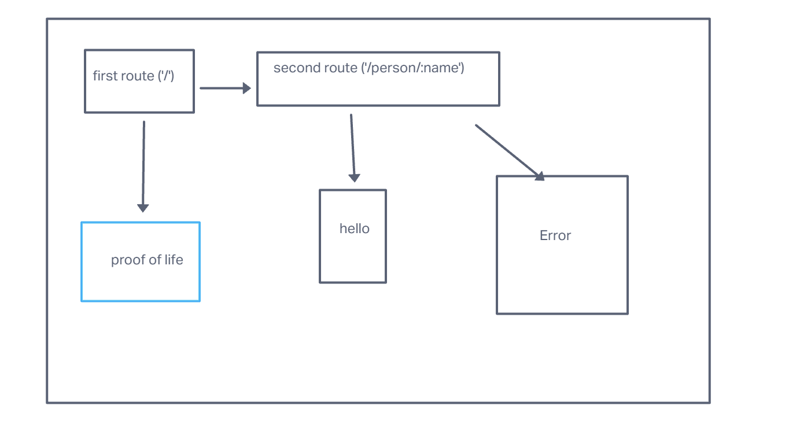

# basic-express-server

Author: Joshua Coffey

## Problem Domain

index.js at the root of your repository, which will act as the “entry point” to your server.
should require src/server.js
should require dotenv, reading PORT from your .env file
It should call the .start() method from the server with the PORT set in your environment
src/server.js which will serve as your server ‘module’ … will contain all of the module connections for the server
Must export an object with a start() method (it should not start on it’s own) and a reference to the express app
Create a middleware folder and add 2 middleware modules to it:
logger.js
Performs a console.log with the request method and path
Import this into your server and set it up to run at the application level for all routes
validator.js
Checks the query string for a name property
Sends the request through when valid, forces an error when not
Create a error-handlers folder and add 2 modules to it:
404.js
Sends a 404/Not-Found message as the response
Import this into your server and set it up to be “used” after your other routes
500.js
Sends a 500/Server Error message as the response
Import this into your server and set it up to be “used” as the last route
Create the /person route within your server.js
This route should use the validator middleware to check the user’s input
If valid, send a JSON object through the response with the name value in it
i.e. {"name": "fred" }

## Links and Resources

GitHub Actions ci/cd
back-end prod server url https://dashboard.render.com/web/srv-chi5j3rhp8u7g2dvarp0/deploys/dep-chi5j43hp8u7g2dvasq0 
Collaborators
Me

Setup
.env requirements (where applicable)
port variable exists within the env sample

How to initialize/run your application (where applicable)
clone repo, npm i, then run nodemon in the terminal

Routes
GET : /success - specific route to hit
Tests
to run tests, after running npm i, run the command npm test

## UML

